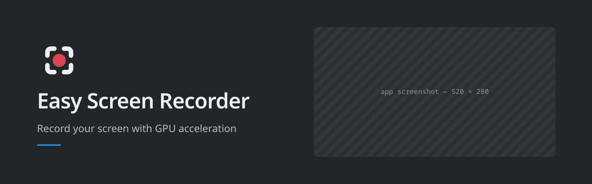

<!--
SPDX-FileCopyrightText: 2026 Dalmau Romaní (Soluciones Conscientes)

SPDX-License-Identifier: GPL-3.0-or-later
-->

<p align="center">
  
</p>

<p align="center">
  <a href="README.md">English</a> ·
  <a href="README.es.md"><strong>Castellano</strong></a>
</p>

<p align="center">
  
  
  
</p>

---

<!-- TODO: GIF de demostración. Cómo grabarlo: docs/screenshots/README.md -->
<p align="center">
  <em>GIF de demostración pendiente — <code>docs/screenshots/demo.gif</code></em>
</p>

## Qué hace

Grabar la pantalla en Wayland suele ser una de dos cosas: una herramienta que
recodifica en la CPU y convierte el portátil en una estufa, o una línea de
comandos con quince opciones. Esto es la capa que falta: la captura se queda en
la GPU y empiezas a grabar en dos clics.

- **Graba cualquier monitor, una región que eliges arrastrando, la ventana en
  foco o una cámara**, con la codificación en la GPU.
- **Modo de solo audio**, a Opus, AAC, FLAC, WAV o MP3, sin encender siquiera la captura de
  vídeo.
- **Pausa y reanuda** a media grabación, y un **atajo global** para empezar y
  parar sin salir de lo que estás haciendo.
- **Elige el dispositivo de audio por ti** —el audio del sistema, el micrófono o varias
  pistas a la vez— y **recuerda dónde van tus grabaciones**.
- **Te dice qué falta antes de darle a grabar**, en vez de fallar a mitad:
  `easy-screen-recorder-cli --check`.

Sin tocar nada: `.mkv`, el mejor códec de hardware que tenga la GPU, el audio
del sistema y 60 fps. Todo lo demás son opciones.

Hay CLI además de interfaz gráfica, y la regla es que el CLI va primero: si algo
no funciona por consola, no llega a la interfaz.

## Instalación

| | |
|---|---|
| **Flathub** | Pronto |
| **`.deb`** | Pronto |
| **Desde el código** | Abajo |

### Desde el código

Dependencias de compilación, exactamente las que pide el CMake:

- **CMake 3.25+** y un compilador de **C++20**
- **Ninja** (o el generador que prefieras)
- **Qt 6.4+**, componentes: `Core` `DBus` `Gui` `Qml` `Quick` `QuickControls2`
  `Widgets` `Concurrent`

Qt es **opcional**: sin él la interfaz gráfica no se compila, y el CLI y los
tests sí.

```bash
cmake -S . -B build -G Ninja
cmake --build build
ctest --test-dir build --output-on-failure
```

En Debian y Ubuntu:

```bash
sudo apt install cmake ninja-build g++ qt6-base-dev qt6-declarative-dev \
  ffmpeg
```

## Dónde funciona

**En cualquier escritorio de Linux, sobre Wayland y sobre X11.** La interfaz es
Qt6/QML con Kirigami, y la captura la hace gpu-screen-recorder, que soporta los
dos servidores gráficos.

Hay dos cosas atadas a KDE Plasma, y las dos se degradan sin ruido fuera:

| | |
|---|---|
| **El atajo global** | Se registra en KGlobalAccel, así que se configura en *Preferencias del sistema → Atajos* como cualquier otro. Fuera de KDE no se registra y no pasa nada más |
| **El icono de bandeja** | Usa StatusNotifierItem, que es lo nativo en Plasma. La mayoría de escritorios lo soportan; GNOME necesita una extensión |

Construido y verificado en KDE Plasma sobre Wayland, y verificado corriendo como
cliente X11 a través de XWayland. **Una sesión X11 pura no se ha probado aquí**
—esta máquina corre Wayland— pero la captura es de gpu-screen-recorder, que
soporta X11 upstream.

### El hardware modesto es el caso, no la excepción

La codificación la hace la GPU, así que la CPU se queda libre. Eso importa justo
donde más duele un grabador que recodifica en CPU: un portátil fino sin margen
térmico.

Medido en la máquina de desarrollo —un **Intel i5-6200U de 2015 con gráficos
integrados HD Graphics 520**, que codifica H.264 y HEVC en hardware—:

| | |
|---|---|
| CLI, coste mínimo del proceso | **0,00 s · 4 MB** de RAM de pico |
| CLI, detección completa del entorno | **0,6–1,2 s · 49 MB** |
| Interfaz, hasta el primer frame pintado | **1,0–1,6 s · 94 MB** |

**Lo único que hay que comprobar antes:** que tu GPU tenga codificador por
hardware. Si no lo tiene, gpu-screen-recorder cae a codificar en CPU
(`h264_software`) y toda la ventaja desaparece. `easy-screen-recorder-cli
--check` dice en qué caso estás: mira la línea `por defecto (hardware)`.

## Requisitos

**Hace falta [gpu-screen-recorder][gsr] instalado.** Es quien hace la captura de
verdad. No va incluido en este programa y no es una biblioteca que enlacemos:
corre como un proceso aparte.

```bash
flatpak install flathub com.dec05eba.gpu_screen_recorder
```

Instálalo **a nivel de sistema, no con `--user`**: la búsqueda mira
`/var/lib/flatpak`, y una instalación de usuario cae en otro sitio.

`ffmpeg` hace falta para el modo de solo audio, que no pasa por GSR.

¿No sabes qué tienes? `easy-screen-recorder-cli --check` dice exactamente qué
hay, qué falta y qué deja de funcionar por ello.

[gsr]: https://git.dec05eba.com/gpu-screen-recorder/about/

## Arquitectura

```
Interfaz Qt/QML/Kirigami  →  libesr  →  gpu-screen-recorder (proceso externo)
```

`libesr` es el núcleo: sin Qt, sin interfaz, y con todo lo que la UI y el CLI
necesitan saber del entorno. GSR se conduce como proceso aparte —argumentos de
ida, JSON por un socket unix de vuelta—, que es lo que mantiene las dos
licencias separadas y lo que permite cambiar de motor de captura sin reescribir
la interfaz.

## Créditos

- **[gpu-screen-recorder][gsr]**, de **dec05eba** — hace la parte difícil. Esto
  es una interfaz independiente, sin relación con el proyecto.
- **[Qt](https://www.qt.io/)** y **[KDE Frameworks](https://develop.kde.org/products/frameworks/)**
  — la interfaz.
- **[FFmpeg](https://ffmpeg.org/)** — la ruta de solo audio.

## ¿Necesitas software a medida?

Hecho por **[Soluciones Conscientes](https://solucionesconscientes.es)**, que
desarrolla aplicaciones a medida: escritorio, web y la fontanería de en medio.

Si esto se acerca a lo que necesitas pero no del todo, o lo quieres montado para
tu forma de trabajar, escríbeme. También hay licencia comercial de este código a
petición.

## Licencia

**GPL-3.0-or-later**, ver [`LICENSE`](LICENSE). Usa gpu-screen-recorder
(GPL-3.0-only) como programa externo independiente; no se incluye ni se
distribuye. Licencia comercial disponible a petición.

Se aceptan contribuciones y requieren firmar un CLA — conservas tu copyright.
Ver [`CONTRIBUTING.md`](CONTRIBUTING.md).
